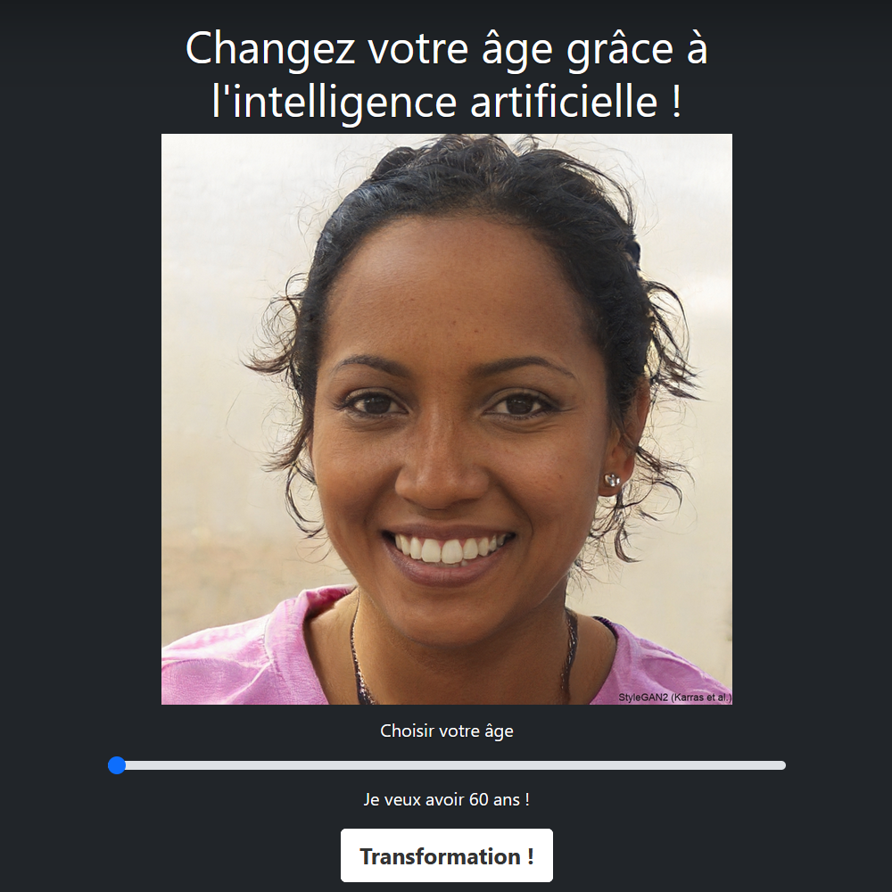
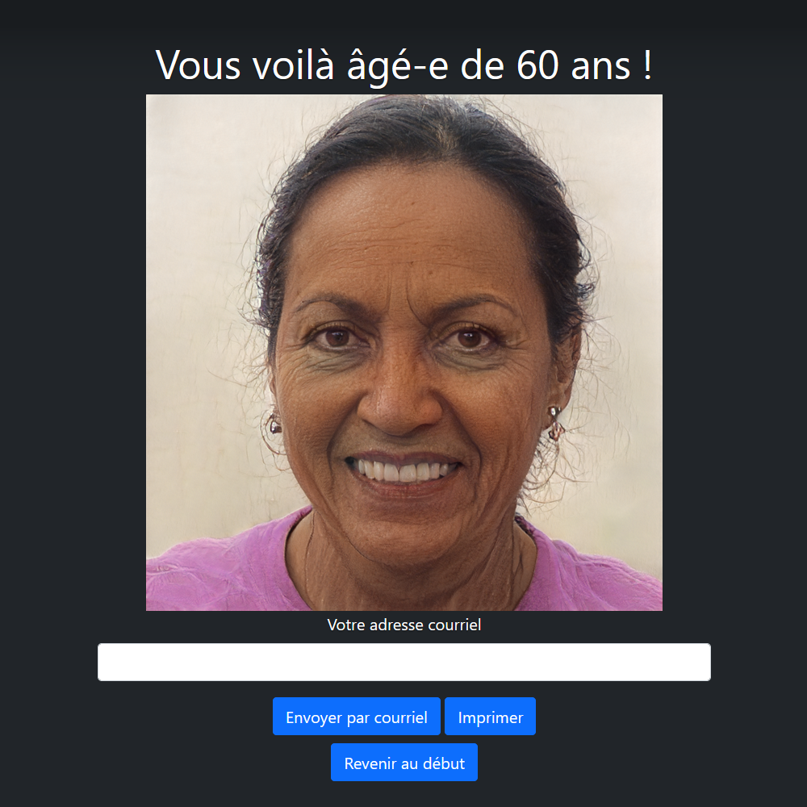

# Face-Aging-Webapp

Face Aging Webapp, using Flask and Only a Matter of Style.

|                    Before                    |                   After                    |
|:--------------------------------------------:|:------------------------------------------:|
|  |  |

## Setup

### Replicate account

- In order to user this, you will need a Replicate account: https://replicate.com/.
- Then, you will need an API token: https://replicate.com/account/api-tokens.

### Installation

You need Python 3.12 and Pip.

```bash
# Clone this repository
git clone git@github.com:Amustache/Face-Aging-Webapp.git

# Go into the folder
cd Face-Aging-Webapp

# Create a virtual environment
python -m venv env

# Activate said environment
source env/bin/activate

# Install dependencies
pip install -r requirements.txt

# Create config file
cp config.py.dist config.py
```

### Configuration

Edit the `config.py` file with the following:
- `SECRET_KEY`: Some random key.
- `REPLICATE_API_TOKEN`: Your Replicate API token.
- `UPLOAD_FOLDER`: Where you want the pics to go.
- `ALLOWED_EXTENSIONS`: What kind of pic you want.
- `SMTP_SERVER`: Your mail server.
- `SMTP_PORT`: Your mail server port.
- `SMTP_USERNAME`: Your mail server username.
- `SMTP_PASSWORD`: Your mail server password.
- `SMTP_SENDER`: What the sender will look like.
- `DEBUG`: `True` if dev, `False` if prod.
- `DEMO`: `True` to use a dummy picture, `False` to use the camera.

## Usage

- Start the webapp: `python app.py`
- Access the webapp: <http://127.0.0.1:5000>

> ⚠️ Note: The first time you use this, the Replicate model may take some time to boot up. It is normal.
> 
> Learn more here: https://replicate.com/docs/how-does-replicate-work#cold-boots.

## Licenses

- This repository is under GPL-3.0 license.
    - Said license is available here: https://github.com/Amustache/Face-Aging-Webapp/blob/master/LICENSE.
    - Code source is available here: https://github.com/Amustache/Face-Aging-Webapp/.
- Flask is under BSD-3-Clause License.
    - Said license is available here: https://flask.palletsprojects.com/en/2.3.x/license/.
    - Code source is available here: https://github.com/pallets/flask.
- SAM is under MIT license.
    - Said license is available here: https://github.com/yuval-alaluf/SAM/blob/master/LICENSE.
    - Code source is available here: https://github.com/yuval-alaluf/SAM.
